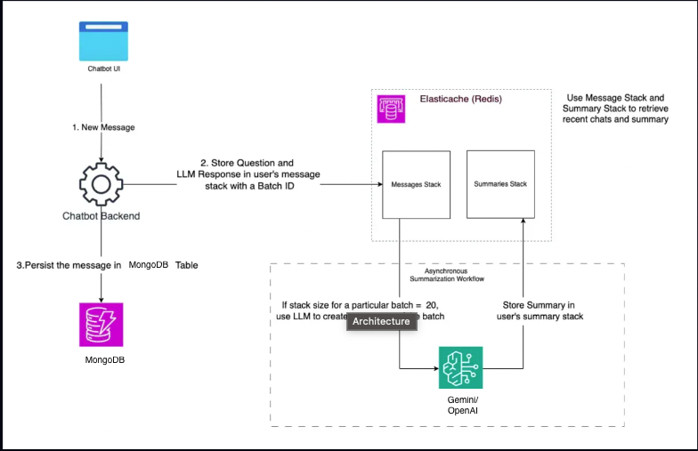

# Chatbot with Summarization and Token Counting

A conversational AI application that leverages Redis and MongoDB for efficient chat history management, utilizes Google Gemini for both conversation and summarization, and provides a simple UI to interact with the chatbot while displaying token usage.

## Table of Contents

- [Features](#features)
- [Architecture Overview](#architecture-overview)
- [Directory Structure](#directory-structure)
- [Prerequisites](#prerequisites)
- [Installation](#installation)
- [Configuration](#configuration)
- [Running the Application](#running-the-application)
- [Usage](#usage)
- [API Endpoints](#api-endpoints)
- [Testing](#testing)
- [Contributing](#contributing)
- [License](#license)
- [Acknowledgments](#acknowledgments)

## Features

- **Conversational AI**: Interact with a chatbot powered by Google Gemini LLM.
- **Summarization**: Automatically summarizes every 20 messages to optimize context handling.
- **Token Counting**: Tracks and displays token usage in real-time.
- **In-Memory Storage**: Uses Redis for fast read/write operations during live conversations.
- **Persistent Storage**: Utilizes MongoDB for long-term chat history storage.
- **Simple UI**: Web interface to chat with the assistant and view token counts.
- **Modular Architecture**: Clean codebase with a well-structured directory hierarchy.

## Architecture Overview

The application comprises the following components:

- **FastAPI Backend**: Serves as the backend API, handling user messages and interactions with the LLM.
- **Redis Cache**: Stores recent messages and summaries for quick access.
- **MongoDB Database**: Persists all chat messages and summaries for long-term storage.
- **Google Gemini LLM Integration**: Provides conversational AI capabilities and summarization.
- **Token Counting**: Uses `tiktoken` to count tokens and demonstrate the efficiency of summarization.
- **Frontend UI**: Simple web interface built with HTML, CSS, and JavaScript.

<a target="_blank">
    
</a>

## Output
<a target="_blank">
    
</a>

## Directory Structure

```
chat_poc/
├── main.py
├── chat_manager.py
├── conversation_handler.py
├── summarization.py
├── data/
│   └── sample_conversation.py
├── utils/
│   ├── __init__.py
│   ├── gemini_api.py
│   ├── redis_client.py
│   ├── mongo_client.py
│   ├── token_counter.py
│   └── config.py
├── templates/
│   └── index.html
├── static/
│   ├── styles.css
│   └── script.js
├── requirements.txt
├── .env
├── README.md
```

## Prerequisites

- **Python 3.7+**
- **Redis Server**
- **MongoDB Server**
- **Google Gemini API Access**

## Installation

### 1. Clone the Repository

```bash
git clone https://github.com/yourusername/chat_poc.git
cd chat_poc
```

### 2. Create a Virtual Environment

```bash
python -m venv venv
```

Activate the virtual environment:

- On Windows:

  ```bash
  venv\Scripts\activate
  ```

- On macOS/Linux:

  ```bash
  source venv/bin/activate
  ```

### 3. Install Dependencies

```bash
pip install -r requirements.txt
```

## Configuration

### 1. Environment Variables

Create a `.env` file in the root directory and add the following environment variables:

```ini
# .env

GEMINI_API_KEY=your-gemini-api-key
REDIS_HOST=localhost
REDIS_PORT=6379
MONGO_URI=mongodb://localhost:27017/
DATABASE_NAME=chat_database
```

**Note:** Replace `your-gemini-api-key` with your actual Google Gemini API key.

### 2. Update Configurations

Ensure that `config.py` reads the environment variables correctly. The provided code already does this.

## Running the Application

### 1. Start Redis Server

If Redis is not already running, start it:

```bash
redis-server
```

### 2. Start MongoDB Server

If MongoDB is not already running, start it:

```bash
# On macOS/Linux
mongod

# On Windows
"C:\Program Files\MongoDB\Server\4.4\bin\mongod.exe"
```

### 3. Run the FastAPI Application

```bash
uvicorn main:app --reload
```

The application should now be running at `http://127.0.0.1:8000`.

## Usage

### Access the Chat UI

Open a web browser and navigate to `http://127.0.0.1:8000` to interact with the chatbot.

### Chat Interface Features

- **Message Input**: Type your messages in the input field at the bottom.
- **Send Button**: Click the "Send" button or press Enter to send your message.
- **Chat Window**: Displays the conversation between you and the assistant.
- **Token Count**: Shows the total number of tokens used in the conversation.

## API Endpoints

### POST `/chat`

Handles user messages and returns the assistant's response along with token counts.

- **Request Body**:

  ```json
  {
    "user_id": "user1",
    "message_text": "Hello, how are you?"
  }
  ```

- **Response**:

  ```json
  {
    "response": "I'm doing well, thank you! How can I assist you today?",
    "token_count": 42
  }
  ```

## Testing

### Debugging

- **Logs**: Check the console output for any error messages.
- **API Testing**: Use tools like Postman or curl to test API endpoints.

## Contributing

Contributions are welcome! If you'd like to contribute to this project, please follow these steps:

1. **Fork the Repository**
2. **Create a Feature Branch**: `git checkout -b feature/YourFeature`
3. **Commit Your Changes**: `git commit -m 'Add YourFeature'`
4. **Push to Your Fork**: `git push origin feature/YourFeature`
5. **Open a Pull Request**

## License

This project does not have a specific license. Please contact the project owner for more information.

## Acknowledgments

- **Google Gemini**: For providing powerful LLM capabilities.
- **FastAPI**: For an easy-to-use web framework.
- **Redis**: For efficient in-memory data storage.
- **MongoDB**: For scalable persistent storage.
- **tiktoken**: For token counting functionality.
- **AWS**: https://github.com/aws-samples/managing-chat-history-and-context-at-scale-in-generative-ai-chatbots
---
